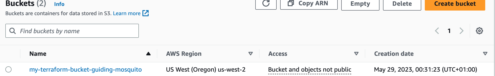
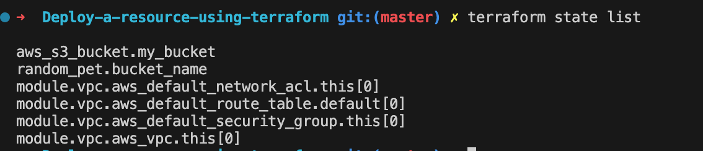

## 1.  How to write a terraform code to deploy a simple resource 

1. Initialize the working directory
`terraform init`

2. Write the Terraform code. Create a new file in your working directory with a .tf extension (e.g., main.tf). This file will contain the Terraform code to deploy your resource.
3. Plan the deployment
`terraform plan`
4. Deploy the resource
`terraform apply`
5. Verify the deployment

6. Clean up (optional)
`terraform destroy`

## 2. Understanding the terrafaform command
1. `terraform init`: This command initializes a new or existing Terraform working directory. It downloads the necessary provider plugins and sets up the backend configuration.

2. `terraform plan`: The plan command creates an execution plan for applying your Terraform configuration. It analyzes your code, compares it with the current state, and shows the changes that will be made to your infrastructure without actually making any modifications.

3. `terraform apply`: With the apply command, Terraform applies the changes defined in your configuration files to your infrastructure. It creates, modifies, or deletes resources to match the desired state specified in the configuration. It prompts for confirmation before making any changes.

4. `terraform destroy`: The destroy command is used to destroy all the resources created by your Terraform configuration. It brings your infrastructure to the state it was in before Terraform was used. Like apply, it prompts for confirmation before proceeding.

5. `terraform validate`: This command validates the syntax and configuration of your Terraform files. It checks for errors and reports any invalid configurations.

6. `terraform state`: The state command allows you to interact with the Terraform state file. You can perform operations like listing resources, moving resources, importing existing resources into the state, and more.

7. `terraform output`: Use the output command to display the values of outputs defined in your Terraform configuration. Outputs are useful for retrieving information about resources created by Terraform, such as IP addresses, resource identifiers, or endpoint URLs.

8. `terraform refresh`: The refresh command updates the Terraform state file with the current state of your infrastructure. It does not make any changes to the resources but synchronizes the state file with the actual infrastructure.

9. `terraform fmt` (formerly terraform format): This command is used to automatically format your Terraform code in a consistent style. It updates your Terraform configuration files to follow recommended formatting conventions, making your code more readable and maintainable. It helps enforce consistent code style across teams and projects.

## 3. Consume an existing module written by terraform, then deploy it and use it to create a resource
1. Obtain the module: You can get the resource from *Terraform Registry*. For this because you already created a bucket, you can just import the bucket using `terraform import`. 
Here's an example
> terraform import module.<module_name>.aws_s3_bucket.my_bucket <bucket_name>

2. Initialize the working directory: run `terraform init`

3. Declare the module: In your main.tf file, use the module block to declare and configure the module. 
4. Configure the module: Configure the module by providing any necessary input variables
5. Deploy the resource: Run `terraform apply`
6. Check your module :`terraform state list`

The resource created here is the S3 bucket

## 3. Write your own module, then consume it and deploy it
1. Create a new directory for your module.

2. Write the module code: Inside the module directory, create a new *.tf* file 
3. Define input variables
4. Create an example configuration: In the same module directory, create a new *.tf* file

## 4. Learn about the functions of terraform; 
1. count(elements): Returns the number of elements in a given list or map.
>count([1, 2, 3])  # Returns 3

> count({ "a" = 1, "b" = 2, "c" = 3 })  # Returns 3

2. length(s): Returns the length of a given string, list, or map. For example:
> length("hello")  # Returns 5

>length([1, 2, 3, 4])  # Returns 4

>length({ "a" = 1, "b" = 2 })  # Returns 2

3. element(list, index): Returns the element at a specified index in a given list. Indexing starts at zero. For example:
> element(["a", "b", "c"], 1)  # Returns "b"

4. concat(list1, list2): Concatenates two lists together. For example:
> concat([1, 2], [3, 4])  # Returns [1, 2, 3, 4]

5. flatten(list): Flattens a nested list into a single-level list. For example:
> flatten([[1, 2], [3, 4]])  # Returns [1, 2, 3, 4]

6. zip(list1, list2): Combines two lists into a single list of tuples. For example:
> zip([1, 2, 3], ["a", "b", "c"])  # Returns [(1, "a"), (2, "b"), (3, "c")]
